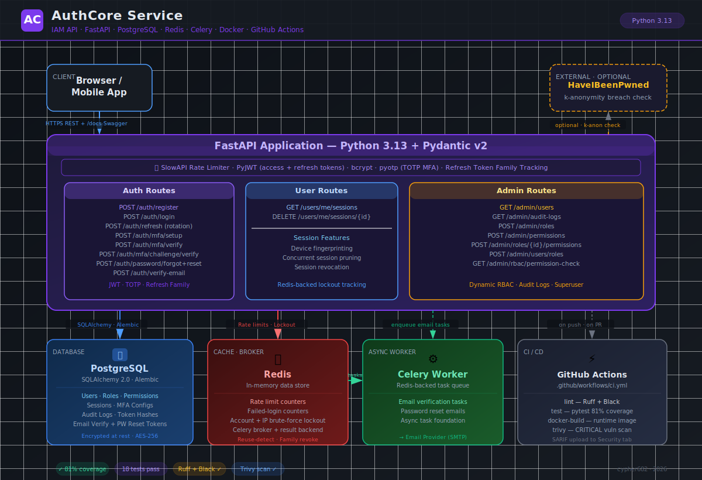

# authcore-service

[](https://github.com/cypher682/authcore-service/actions/workflows/ci.yml)

Production-grade Identity and Access Management API built with FastAPI, PostgreSQL, Redis, Celery, Docker, and GitHub Actions.

AuthCore goes beyond standard auth CRUD — it implements real token lifecycle management, MFA enforcement, session control, and audit discipline. Docker-first development, automated CI gates, image scanning, and structured evidence are part of the delivery.

---

## Highlights

- JWT access tokens and refresh token rotation with family-level reuse detection
- TOTP MFA setup, verification, disable flow, and login challenge gate
- Session management with device fingerprints and concurrent session pruning
- Dynamic RBAC with roles, permissions, user-role assignment, and route-level checks
- Structured audit logs for auth, MFA, RBAC, and session events
- Redis-backed rate limiting and account/IP brute-force lockout
- Password strength policy with optional HaveIBeenPwned k-anonymity breach checking
- Email verification and password reset token flows
- Admin APIs for users, roles, permissions, RBAC checks, and audit log queries
- Pytest suite with 81% coverage
- GitHub Actions CI: lint → test → Docker build → Trivy CRITICAL scan

---

## Tech Stack

| Area | Tools |
|---|---|
| API | FastAPI, Python 3.13, Pydantic v2 |
| Database | PostgreSQL, SQLAlchemy 2.0, Alembic |
| Cache / lockout | Redis |
| Async worker | Celery with Redis broker |
| Security | bcrypt, PyJWT, pyotp, SlowAPI |
| Password checks | Local strength rules, optional HaveIBeenPwned range API |
| Testing | pytest, pytest-asyncio, pytest-cov, httpx, Factory Boy |
| Delivery | Docker, Docker Compose, GitHub Actions, Trivy |

---

## Architecture



```
Client
  │
  ▼
FastAPI app (Uvicorn, Python 3.13)
  │── PostgreSQL  — users, sessions, token families, MFA configs, RBAC, audit logs
  │── Redis       — rate limit counters, failed-login counters, lockout state
  │── Celery      — background task worker (email delivery)
  ▼
GitHub Actions CI
  ├── Ruff lint
  ├── Black format check
  ├── Docker Compose tests (real Postgres + Redis, Alembic migrations)
  ├── Coverage gate (80%)
  ├── Docker image build (multi-stage, non-root runtime user)
  └── Trivy CRITICAL vulnerability scan (SARIF upload)
```

---

## API Surface

| Method | Path | Purpose |
|---|---|---|
| `GET` | `/health` | Service health |
| `POST` | `/api/v1/auth/register` | Register user and issue tokens |
| `POST` | `/api/v1/auth/verify-email` | Verify email address with token |
| `POST` | `/api/v1/auth/verify-email/resend` | Resend verification token |
| `POST` | `/api/v1/auth/login` | Login and issue tokens |
| `POST` | `/api/v1/auth/refresh` | Rotate refresh token |
| `POST` | `/api/v1/auth/password/forgot` | Request password reset email |
| `POST` | `/api/v1/auth/password/reset` | Reset password with valid token |
| `POST` | `/api/v1/auth/mfa/setup` | Create pending TOTP config |
| `POST` | `/api/v1/auth/mfa/verify` | Enable MFA with current TOTP code |
| `POST` | `/api/v1/auth/mfa/challenge/verify` | Exchange MFA challenge token + TOTP for bearer tokens |
| `POST` | `/api/v1/auth/mfa/disable` | Disable MFA with current TOTP code |
| `GET` | `/api/v1/users/me/sessions` | List current user's active sessions |
| `DELETE` | `/api/v1/users/me/sessions/{session_id}` | Revoke a session |
| `GET` | `/api/v1/admin/users` | List users (superuser) |
| `GET` | `/api/v1/admin/audit-logs` | Query audit logs (superuser) |
| `POST` | `/api/v1/admin/roles` | Create role |
| `POST` | `/api/v1/admin/permissions` | Create permission |
| `POST` | `/api/v1/admin/roles/{role_id}/permissions` | Attach permission to role |
| `POST` | `/api/v1/admin/users/roles` | Assign role to user |
| `GET` | `/api/v1/admin/rbac/permission-check` | Verify dynamic permission access |

---

## Local Development

**Prerequisites:** Docker Desktop

Copy the example env file and set a real secret key:

```bash
cp .env.example .env
# Edit .env — set APP_SECRET_KEY to a random value:
python -c "import secrets; print(secrets.token_hex(32))"
```

Start the stack:

```bash
docker compose up -d --build
docker compose exec app alembic upgrade head
```

Open Swagger UI:

```
http://localhost:8000/docs
```

Run tests:

```bash
docker compose exec -e COVERAGE_FILE=/tmp/.coverage app \
  pytest --cov=app --cov-report=term-missing --cov-fail-under=80 -q
```

Run quality gates:

```bash
docker compose exec -e RUFF_CACHE_DIR=/tmp/ruff_cache app ruff check app tests alembic
docker compose exec app black --check app tests alembic
```

---

## Key Implementation Decisions

**Refresh token reuse detection**
AuthCore tracks refresh tokens by family. Only the latest issued token in a family is valid. If an older token is reused, it is treated as a theft signal — the entire family is revoked and a `401` is returned. Failure audit events are explicitly committed to Postgres before raising the exception, so the transaction rollback cannot silently erase the record of suspicious activity.

**MFA as a login gate**
When MFA is enabled, a correct password does not issue bearer tokens. Login returns a short-lived challenge token instead. Full tokens are only issued after the client submits a valid TOTP code to `/auth/mfa/challenge/verify`. Password verification and authentication completion are deliberately separate states.

**Redis for lockout counters**
Failed login attempts increment a Redis key with a TTL rather than writing to Postgres. These are ephemeral, fast-changing values with no durability requirement — Redis is the right tool.

**Direct bcrypt over Passlib**
Passlib's backend probe has compatibility issues with bcrypt under Python 3.13. The implementation uses `bcrypt` directly — behavior is identical.

**SQLAlchemy `metadata` column conflict**
`metadata` is a reserved attribute on SQLAlchemy's declarative base. The `AuditLog` model maps the database column to a different Python-side attribute name:

```python
event_metadata: Mapped[dict] = mapped_column("metadata", JSON, nullable=True)
```

---

## CI/CD

Workflow: `.github/workflows/ci.yml`

| Job | What it does |
|---|---|
| `lint` | Ruff + Black format check |
| `test` | Docker Compose startup, Alembic migrations, pytest with 80% coverage gate |
| `docker-build` | Multi-stage runtime image build, non-root user |
| `trivy` | CRITICAL vulnerability scan, SARIF upload to GitHub Security tab |

---

## Security Notes

- `.env` files are gitignored and must not be committed
- Refresh token reuse revokes the entire token family
- Failed login counters tracked by account and IP in Redis; lockout returns `423`
- Route-level rate limiting via SlowAPI; exceeded limit returns `429`
- Superusers bypass named permission checks; normal users require explicit role assignment
- MFA login gate: successful password verification returns a challenge token, not bearer tokens
- Password strength enforced at registration; optional HaveIBeenPwned k-anonymity check available via `PASSWORD_BREACH_CHECK_ENABLED=true`
- Email verification and password reset tokens stored as SHA-256 hashes — raw token never persisted
- Password reset revokes all existing refresh token families for the user

---

## Deployment

Render deployment is prepared. `render.yaml` and `scripts/start.sh` are committed.

- Set `RUN_MIGRATIONS_ON_START=true` to run `alembic upgrade head` before Uvicorn starts
- Use `postgresql+asyncpg://...` for `DATABASE_URL`
- Render's `PORT` environment variable is honoured automatically
- Deployment guide: `docs/deployment/render.md`

Live URL: not deployed yet.

---

## Evidence

| Evidence | Location |
|---|---|
| Evidence index | `docs/evidence/README.md` |
| API smoke proof | `docs/evidence/api-smoke-evidence.json` |
| CI evidence | `docs/evidence/ci-evidence.md` |
| Local browser demo | `docs/demo/index.html` |
| Postman collection | `docs/evidence/authcore.postman_collection.json` |
